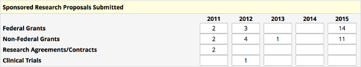
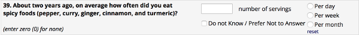
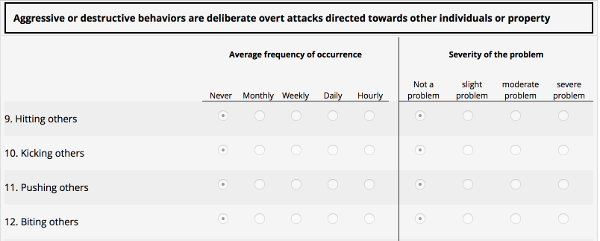
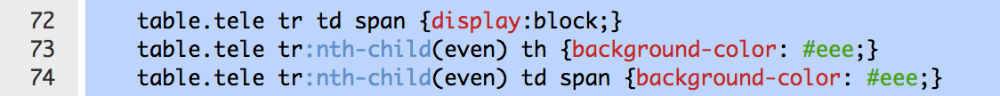

# Shazam External Module

There is additional documentation to help you configure this once installed.

### What does it do?
This module allows you to create custom instrument layouts, similar to custom input matrixes.  You can arrange dropdown, radio, input, and other fields into a custom html element and insert that into your instrument.

It does require a little bit of HTML skill, but you can do simple things like this:



Or, you can get much more creative:



Or, you can go crazy as in this side-by-side radio example:



The way this works is to insert a 'descriptive' field on your form where you want to put the custom table.

Next, you set up the external module and define your custom HTML.  Here is an example:

```html
<table class='fy_summary'>
    <tr>
        <th></th>
        <th>2012</th>
        <th>2013</th>
        <th>2014</th>
        <th>2015</th>
        <th>2016</th>
    </tr>
    <tr>
        <th>Federal Grants</th>
        <td><div class='shazam shazam-icons'>fed_grants_fy12</div></td> <!-- including shazam-icons will add the history / data quality icons -->
        <td><div class='shazam'>fed_grants_fy13</div></td>
        <td><div class='shazam'>fed_grants_fy14</div></td>
        <td><div class='shazam'>fed_grants_fy15</div></td>
        <td><div class='shazam'>fed_grants_fy16</div></td>
    </tr>
    <tr>
        <th class='shazam'>nf_grants:label</th> <!-- This will map the LABEL to the field nf_grants -->
        <td class='shazam'>nf_grants_fy12</td>
        <td class='shazam'>nf_grants_fy13</td>
        <td class='shazam'>nf_grants_fy14</td>
        <td class='shazam'>nf_grants_fy15</td>
        <td class='shazam'>nf_grants_fy16</td>
    </tr>
    <tr><th>Research Agreements/Contracts</th>
        <td class='shazam'>rsch_contract_fy12</td>
        <td class='shazam'>rsch_contract_fy13</td>
        <td class='shazam'>rsch_contract_fy14</td>
        <td class='shazam'>rsch_contract_fy15</td>
        <td class='shazam'>rsch_contract_fy16</td>
    </tr>
    <tr data-shazam-mirror-visibility="clinical_trials"> <!-- This will make this entire TR only visible when the field 'clinical_trials' is visible -->
        <th>Clinical Trials</th>
        <td class='shazam'>ct_fy12</td>
        <td class='shazam'>ct_fy13</td>
        <td class='shazam'>ct_fy14</td>
        <td class='shazam'>ct_fy15</td>
        <td class='shazam'>ct_fy16</td>
    </tr>
</table>
```

Then, to make customization easier, you can use CSS instead of in-line CSS to tweak the look and feel.



It also supports the abiliy to hide and show some of your custom elements based on other branched REDCap elements.  This means you could make a complex table and be able to hide/show rows of that table based on another REDCap field - similar to how one can do branching on rows in an input matrix.

Javascript can only be added/edited/removed by a superuser to prevent users from doing bad things :-)

Have fun!


### Advanced Tricks ###

In some cases I've needed to have another javascript function do something to the DOM AFTER shazam has fired.  So, I added
a callback that you can register from the 'other' EM... Shazam will then call this function before it visualizes the modified DOM.

For example:
```javascript
// In another module that writes something to the client
$(document.ready( function() {
    // Register the Shazam callback
    Shazam.beforeDisplayCallback = function() {
        console.log ('This function will get called AFTER Shazam has rearranged the DOM just before it shows the page to the end-user');
    }
});
```


#### DISCLAIMER:
This is an early release and I'm sure there are some issues - so please post.
